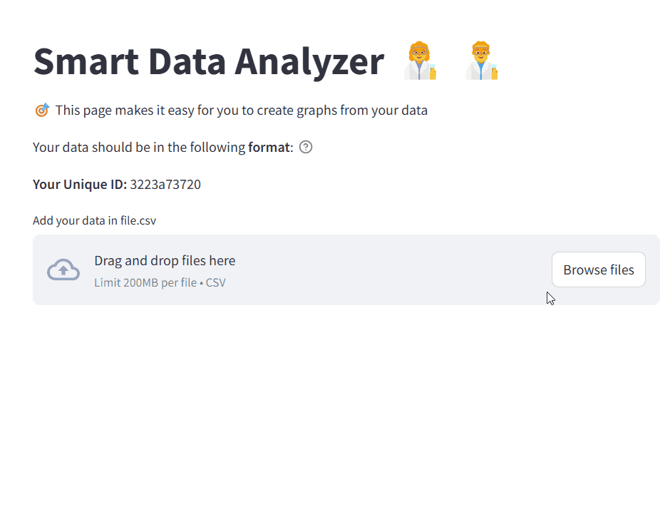
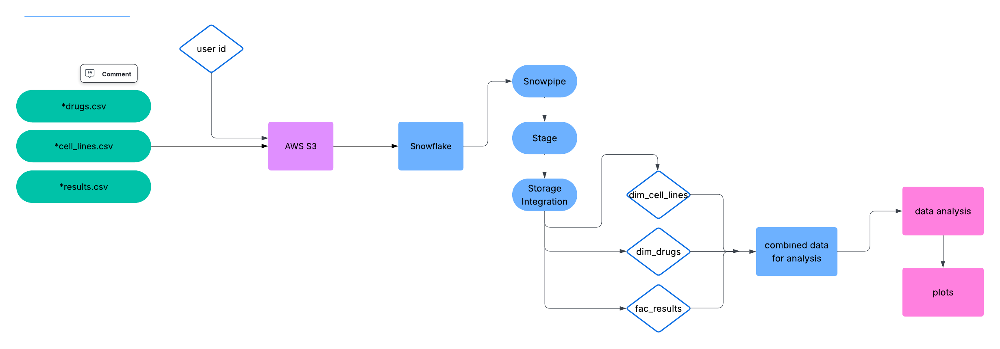
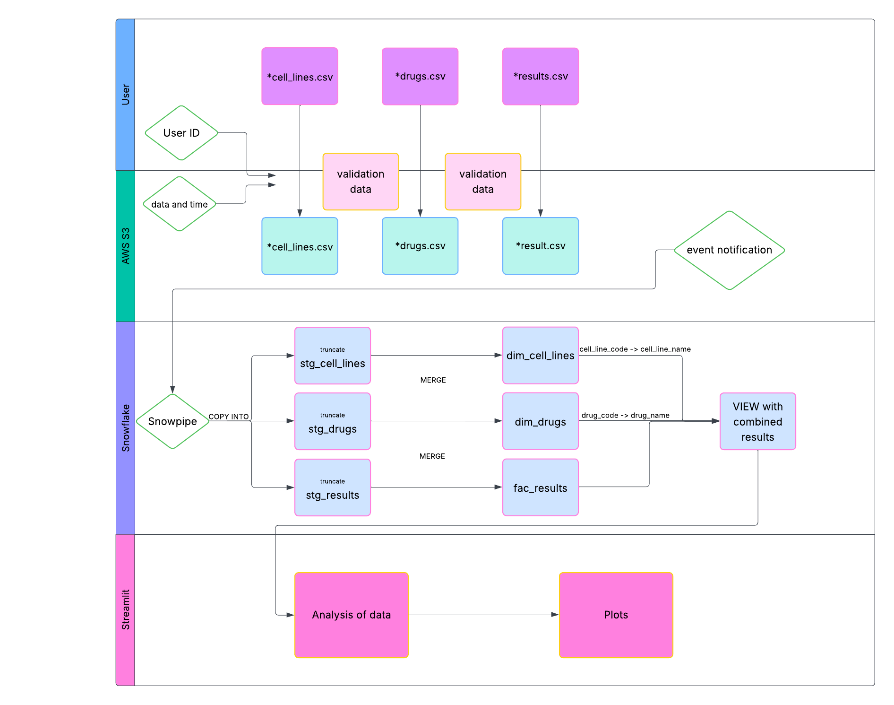

# ✨ Smart-Data-Analyzer ✨
designed to make it easy for you to create graphs from your data. 📊

## 🚀 Technologies

## 🎥 Demo

## 📦 Streamlit App

here will be link 🔗

## 📝 Description

This application is intended for users who want to analyze data from photodynamic therapy experiments. It allows you to easily upload data and then analyze and visualize the results.

## 📁 Requirements

**File Format:** `.csv`
| File Name | Required Columns |
|-----------|------------------|
| `data_photodynamic_therapy_cell_lines.csv` | `cell_line_code`, `cell_line_name` |
| `data_photodynamic_therapy_drugs.csv` | `drug_code`, `drug_name` |
| `data_photodynamic_therapy_results.csv` | `experiment_id`, `experiment_number`, `cell_line_code`, `treatment_time`, `drug_code`, `drug_concentration`, `result_001 - result_012` |

**📥 Sample Files for Completion**

Click below to download the CSV templates you need to fill in:

- [your_cell_lines.csv](sample_files/your_cell_lines.csv)
- [your_drugs.csv](sample_files/your_drugs.csv)
- [your_results.csv](sample_files/your_results.csv)

## 🗂️ Data Architecture
  

## 📈 Data Flow
  

## ⚙️ Project status

The project is currently **in progress 🚘🔜**

## Branch Information:

main branch:
The first working version of the application. It runs in the cloud and is integrated with AWS S3 and Snowflake for data storage and processing.

develop branch:
This is the active development branch where I’m currently working on new features. The application here is designed to run locally.

## ❓ Questions or suggestions

Feel free to reach out with any questions or suggestions! 📧
